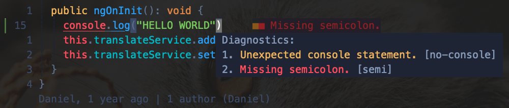
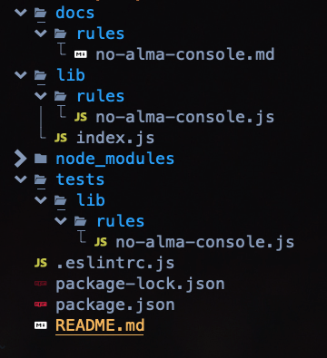

# ESLint Plugins, rules and create your own

---

### Who Am I?

- Software Engineer @ One Identity
- Like to work on own project ideas

===

## What is ESLint?

---

### ESLint

- A configurable JavaScript linter
- Helps you find and fix problems
  - Potential runtime bugs
  - Not following best practices
  - Styling issues



---

### Rules

Building block of ESLint


---

### Rules

- Validates code to meet certain expectation
- What to do if it doesn't meet the expectation
- Can also contain additional configuration


---

### Config file

- Several formats are supported

```json
{
  "env": {
    "browser": true,
    "es2021": true
  },
  "extends": "eslint:recommended",
  "parserOptions": {
    "ecmaVersion": "latest",
    "sourceType": "module"
  },
  "rules": {
    "quotes": ["error", "single"],
    "semi": ["error", "always"],
    "no-console": ["warn", { "allow": ["clear", "table", "debug", "error"] }]
  }
}
```

---

### Plugins

An npm module that can contain a set of ESLint rules, configurations, processors, and environments.

A common use case is to enforce best practices. E.g.:

- [@angular-eslint/eslint-plugin](https://www.npmjs.com/package/@angular-eslint/eslint-plugin)
- [eslint-plugin-unicorn](https://www.npmjs.com/package/eslint-plugin-unicorn)

===

## How rules work?

---

### Parsers

- AST (Abstract Syntax Tree)
- [Espree](https://github.com/eslint/espree)


---

### AST

```py
while b != 0:
  if a > b:
    a = a - b
  else:
    b = b - a
return a
```


===

## Create plugin with custom rules?


---

### Naming

Create a folder with the following naming convention:

- `eslint-plugin-<plugin-name>`
- `@<scope>/eslint-plugin-<plugin-name>`
- `@<scope>/eslint-plugin`

---

### Create a plugin

The easiest way is to use Yeoman which has an [eslint-generator](https://www.npmjs.com/package/generator-eslint):

- `yo eslint:plugin`

```shell
? What is your name? Danie Lazar
? What is the plugin ID? alma
? Type a short description of this plugin: It's just a test
? Does this plugin contain custom ESLint rules? Yes
? Does this plugin contain one or more processors? No
```

- `yo eslint:rule`

```shell
? What is your name? Daniel Lazar
? Where will this rule be published? ESLint Plugin
? What is the rule ID? no-alma-console
? Type a short description of this rule: A console.log should not contain alma!
? Type a short example of the code that will fail: console.log('alma');
```

---

### Create a plugin



===

## How to write a rule and test?

---

### Let's look at the generated code

tests/lib/rules/no-alma-console.js

```js
const ruleTester = new RuleTester();
ruleTester.run("no-alma-console", rule, {
  valid: [],

  invalid: [
    {
      code: "console.log('alma');",
      errors: [{ message: "Fill me in.", type: "Me too" }],
    },
  ],
});
```

---

### Let's look at the generated code

lib/rules/no-alma-console.js

```js
module.exports = {
  meta: {
    type: null, // `problem`, `suggestion`, or `layout`
    docs: {
      description: "A console.log should not contain alma!",
      recommended: false,
      url: null, // URL to the documentation page for this rule
    },
    fixable: null, // Or `code` or `whitespace`
    schema: [], // Add a schema if the rule has options
  },

  create(context) {
    return {
      // visitor functions for different types of nodes
    };
  },
};
```

---

### Visitor functions and selectors

- Extended AST functionality
  - [CSS like selectors](https://eslint.org/docs/latest/extend/selectors#what-syntax-can-selectors-have)
  - Functions for getting particular code parts
- [AST Explorer](https://astexplorer.net/) can be useful

---

### How to show issues?

The create function's context object has a report function:

```js
context.report({
  node,
  messageId: "shouldNotContainAlma",
});
```

===

## A very simple example


Btw you can find this on [GitHub](https://github.com/ducktordanny/vtm-eslint-presentation/tree/master/example)

===

## That's it! Thank you! Q&A?

[GitHub](https://github.com/ducktordanny), [Presentation](https://github.com/ducktordanny/vtm-eslint-presentation), [Example](https://github.com/ducktordanny/vtm-eslint-presentation/tree/master/example), [ESLint docs](https://eslint.org/docs/latest/)

My own ESLint plugin: [ng-module-sort](https://github.com/ducktordanny/eslint-plugin-ng-module-sort)


